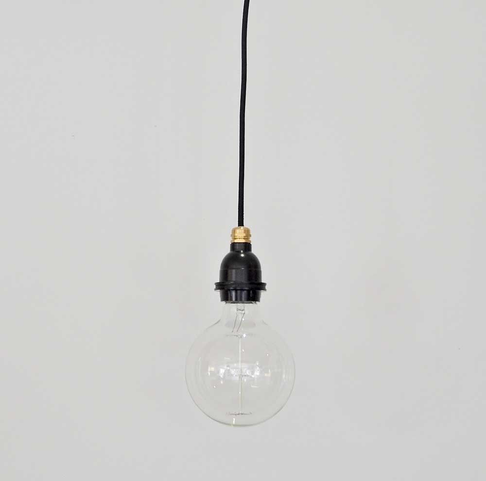
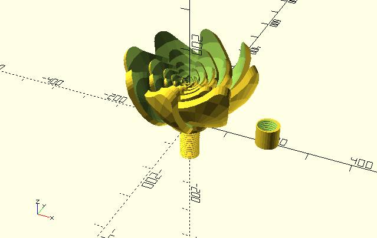

# chyrak
### The name of our project is simple - Chyrak

We decided to combine the concepts of Art and Household items to design a pretty lampshade that diffuses the light that your lamp emits.  

It is simple, yet useful, especially when you have a lonely lamp hanging down from the ceiling, just like this:

 

One of this lampshade's properties is its portability. You can easily remove from and put it on any lamp because of the joints in the middle of our lampshade. (Here will be the picture of it) 

In other words, one part of the lampshade is just the reflection of another. Moreover, we've added university name at the top of our lampshade. (Here will be the photo of it) 

To make our project more aesthetic, we decided to design a couple of flowers, who doesn't like flowers after all?? :cherry_blossom::cherry_blossom::cherry_blossom:

This lotus-like flower can be attached to the lampshade in this way (Here will be the photo)